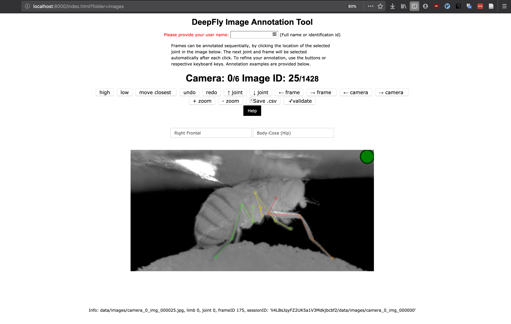

## Setup Guide

### Firebase setup

- Create Firebase account and a new project
- Open the Database page and create a new Realtime Database
- In the rules tab of the Database, change the rules to:

  ```
  {
    "rules": {
     "$uid": {
         ".read": "auth.uid === $uid",
         ".write": "auth.uid === $uid"
     }
    }
  }
  ```

- Under Develop > Authentication > Sign-in method, enable the Anonymous sign-in provider

### Annotation tool setup

- In the js/index.js file, add a new config dictionary.
- In the Firebase project overview, click on "Add Firebase to your web app" and copy the ```var config```. Add it to the newly created config dictionary like in the other examples.
- In the config dictionary, makes sure to include the keys ```limb_names```, ```part_names```, ```bones```, ```camera_visible_limbs```.

Example:

```
apiKey: "APIKEY",
authDomain: "ski-dataset.firebaseapp.com",
databaseURL: "https://ski-dataset.firebaseio.com",
projectId: "ski-dataset",
storageBucket: "ski-dataset.appspot.com",
messagingSenderId: "ID",

move_closest: false,
suggestions: true,
image_size: 900,
invisible_joints_color: "blue",
num_cameras: 1,
num_images: {},

limb_names: ["Person"],
camera_visible_limbs: [[0]],

part_names: ['head_top', 'neck',
             'right_shoulder', 'right_ellbow', 'right_hand', 'right_pole_basket',
             'left_shoulder', 'left_ellbow', 'left_hand', 'left_pole_basket',
             'right_hip', 'right_knee', 'right_ankle',
             'left_hip', 'left_knee', 'left_ankle',
             'right_ski_tip', 'right_toes', 'right_heel', 'right_ski_rear',
             'left_ski_tip', 'left_toes', 'left_heel', 'left_ski_rear'],

bones: [[0,1], [1,2], [2,3], [3,4], [4,5], [1,6], [6,7], [7,8], [8,9],
        [2,10], [10,11], [11,12], [6,13], [13,14], [14,15],
        [16,17], [17,18], [18,19], [12,17], [12,18],
        [20,21], [21,22], [22,23], [15,21], [15,22]]
```

### Data Set conventions

Images must be named in the following convention: ```camera_0_img_000001.png```
Place them inside the ```./data/``` folder. Images can be placed in subfolders.

## Creating Annotations

Open ```index.html``` in a web browser and change the URL to point to the specified folder like in the following example:

```
.../drosophilaannotate/index.html?folder=ski_dataset/5UHRvqx1iuQ/5+frames=s1e24+ext=.png+config=ski_dataset
```

- ```ski_dataset/5UHRvqx1iuQ/5``` is the folder inside the ```./data/``` folder where the images to annotate are located.
- ```frames=s1e24``` specifies the range of images
- ```ext=.png``` specifies the file extension of the images
- ```config=ski_dataset``` specifies the name of the config created in the setup

Provide an identification on the top of the page. Using the buttons (or keyboard shortcuts), various settings like high or low confidence in points or moving the closest point can be toggled.

## Downloading the annotations

You can download all your annotations using Google Firebase, using  Database --> Export Json. 
You can parse the json code using a modified version of the the following code:

```python
# parse json file annotations
if not self.unlabeled and isfile(self.json_file):
    json_data = json.load(open(self.json_file, "r"))
    for session_id in json_data.keys():
        if session_id not in self.session_id_train_list:
            print("Ignoring session id: {}".format(session_id))
            continue
        for folder_name in json_data[session_id]["data"].keys():
            if folder_name not in self.folder_train_list:
                continue
            for image_name in json_data[session_id]["data"][folder_name].keys():
                key = ("/data/annot/" + folder_name, image_name)
                # for the hand annotations, it is always correct ordering
                self.cidread2cid[key[FOLDER_NAME]] = np.arange(skeleton.num_cameras)
                cid_read, img_id = parse_img_name(image_name)

                try:
                    pts = json_data[session_id]["data"][folder_name][image_name]["position"]
                except:
                    print("Cannot get annotation for key ({},{})".format(key[0], key[1]))
                    continue
                self.annotation_dict[key] = np.array(pts)
```
## Running the annotation tool
To have run the tool under localhost you can use python simple html server, under the root folder,

```python
python -m SimpleHTTPServer
```
Then, you can access to the annotation tool at localhost:8000.

<p align="center">

</p>


## Acknowledgment
Thanks Roman Bachmann for creating this README.
